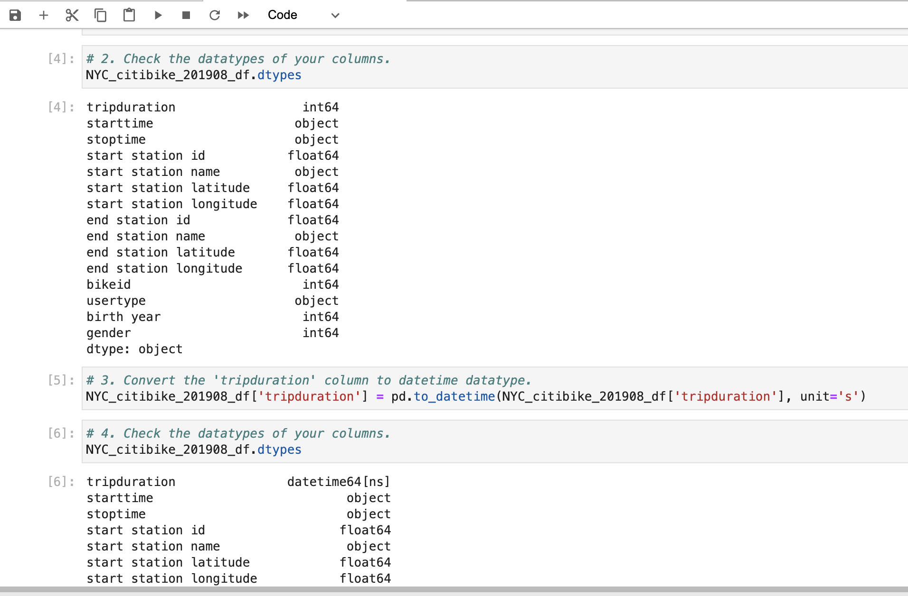
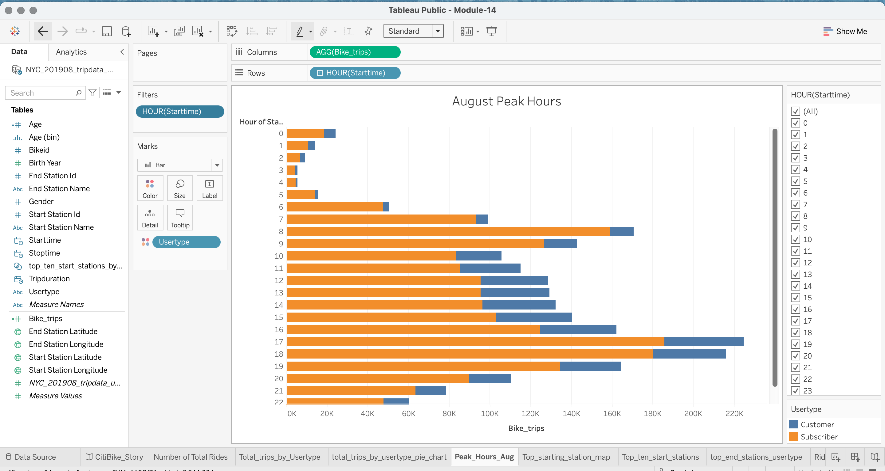
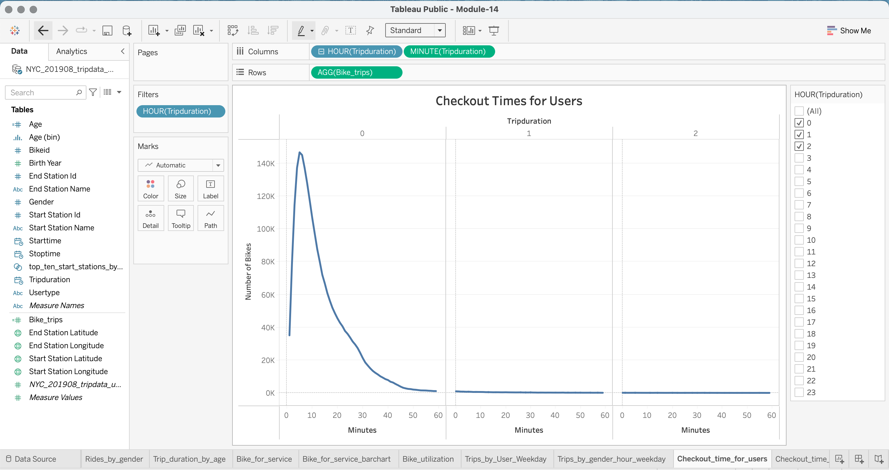
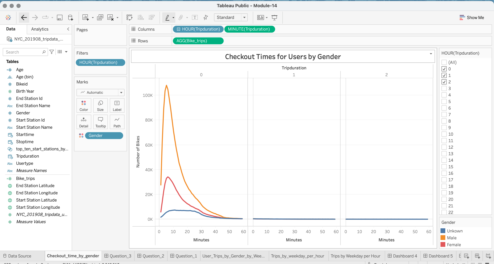
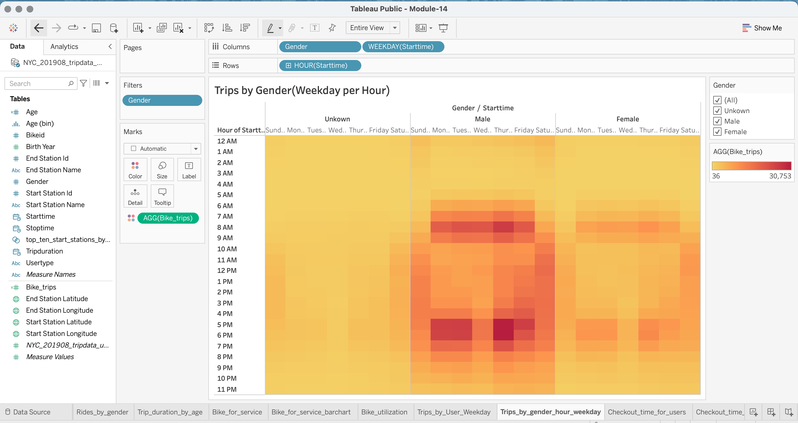
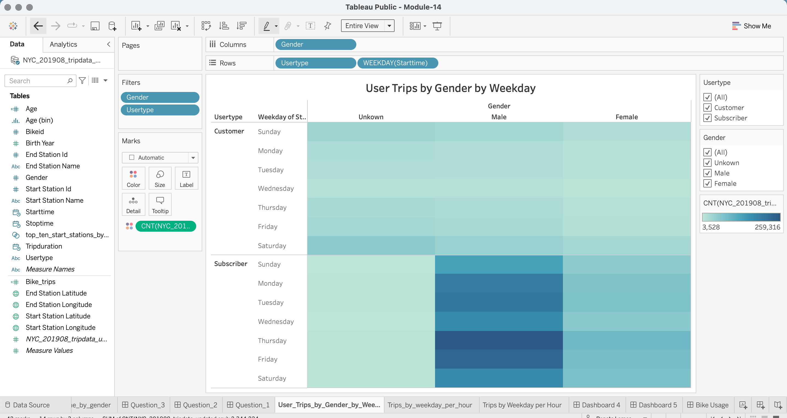
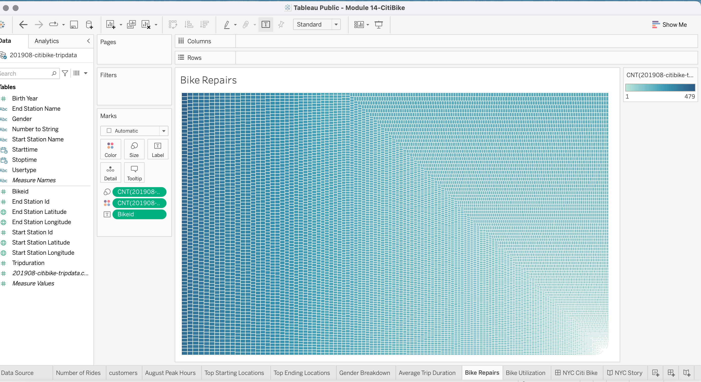

# bikesharing
# NYC CitiBike Story

#### *Link to NYC CitiBike Story:*
[link to dashboard](LINK GOES HERE "https://public.tableau.com/views/Module-14_16455550074700/CitiBike_Story?:language=en-US&:retry=yes&publish=yes&:display_count=n&:origin=viz_share_link")

## Purpose:
To determine if a bikesharing program in Des Moines is a solid business proposal by analyzing NYC CitiBike data. Although, the demographics and population is different in Des Moines the analysis will provide visualizations that can better determine the conditions required for a susscessful bikesharing program.

## Background
A cliente has an interest in opening a CitiBike (bikesharing) in their home town of Des Moines,to convince investors that a bike-sharing program in Des Moines is a solid business proposal.The cliente has asked to review the August 2019 Citibike data from NYC and answer some key questions, such peak hours of the day, what gender uses the bike more often and trip duration. 

### Overview:
>Deliverable 1: Change Trip Duration to a Datetime Format.

>Deliverable 2: Create Visualizations for the Trip Analysis.

>Deliverable 3: Create a Story and Report for the Final Presentation.

### Asks:
* Show the length of time that bikes are checked out for all riders and genders.

* Show the number of bike trips for all riders and genders for each hour of each day of the week.

* Show the number of bike trips for each type of user and gender for each day of the week.

### Results:

#### *First change the Trip duration to a Datetime format.*

-------------------------------------------------------------------------------------
#### *1. Peak hours are between 6-10 am and 4-8pm.*

#### *2. Bike trip duration last 6-7 minutes.*

#### *3. Males make up more than half of the users.*

#### *4. Bike usage.*

### Summary:

1. Peak hours for bikesharing seem to correlate with travel time to and from work. Out of those users males make up more than half of the bike users.

2. Subscribers use the bike far more often than customers. Therefore, the target market is males who can bike to and from work.To further understand the pattern of bike usage it would be ideal to create a graph that shows the lenght of trips by distance(miles).

3. The peak ages are 25-30 years of age with a considerable peak at 50 years. I would like to further dissect the data by age and gender.

4. The optimun time for bike repairs is 1-5am, during the slow hours.

